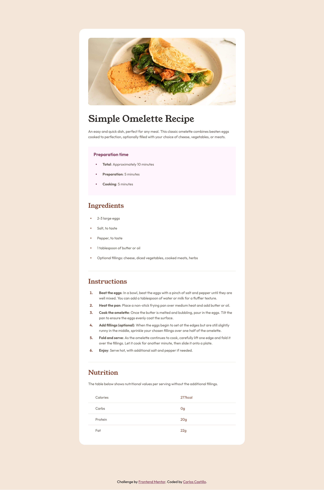

# Frontend Mentor - Recipe page solution

This is a solution to the [Recipe page challenge on Frontend Mentor](https://www.frontendmentor.io/challenges/recipe-page-KiTsR8QQKm). Frontend Mentor challenges help you improve your coding skills by building realistic projects.

## Table of contents

- [Overview](#overview)
  - [The challenge](#the-challenge)
  - [Screenshot](#screenshot)
  - [Links](#links)
- [My process](#my-process)
  - [Built with](#built-with)
- [Author](#author)

**Note: Delete this note and update the table of contents based on what sections you keep.**

## Overview

### Screenshot

### Links

- Solution URL: [https://www.frontendmentor.io/solutions/recipe-page-with-scss-and-itcss-structure-yi79B8JmV4](https://www.frontendmentor.io/solutions/recipe-page-with-scss-and-itcss-structure-yi79B8JmV4)
- Live Site URL: [https://charliecastleweb.github.io/fem-recipe-page/](https://charliecastleweb.github.io/fem-recipe-page/)

## My process

### Built with

- Semantic HTML5 markup
- CSS custom properties
- SCSS / ITCSS
- Flexbox
- Mobile-first workflow

## Author

- Frontend Mentor - [@CharlieCastleWeb](https://www.frontendmentor.io/profile/CharlieCastleWeb)
